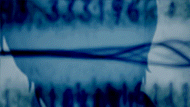

# PakmanGames

---

##  About me

 
I aspire to solve real-life problems and make the world a better place through the code I write.

---

## 💼 Languages and Tools

    <table>
        <tr align="center">
            <td width="45px" style="padding: 15px;" >
                
            </td>
            <td width="45px" style="padding: 15px;">
                
            </td>
            <td width="45px" style="padding: 15px;">
                
            </td>
            <td width="45px" style="padding: 15px;">
                
            </td>
            <td width="45px" style="padding: 15px;">
                
            </td>
            <td width="45px" style="padding: 15px;">
                
            </td>
            <td width="45px" style="padding: 15px;">
                
            </td>
            <td width="45px" style="padding: 15px;">
                
            </td>
        </tr>
    </table>

---

  
  

---

## 📫 Connect with me

