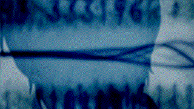

# Andy Pak

---

##  About me

    
     
    <!-- 
Currently pursuing a Bachelor's of Engineering in Software Engineering at <a href="https://www.eng.mcmaster.ca/" target="_blank">McMaster University</a>.

    
Interested in full-stack development and infrastructure.

    
Feel free to <a href="https://www.linkedin.com/in/andy-pak/">connect</a> with me!
 -->

- Currently a SWE Intern at Citi
- Previously a SDE Intern at SOTI
- SWE Student at McMaster University

- Interested in full-stack development and infrastructure
- Reach out on [LinkedIn](https://www.linkedin.com/in/andy-pak/) or at [contact@apak.ca](mailto:contact@apak.ca)

---

## 💼 Languages and Tools

    <table>
        <tr align="center">
            <td width="70px" style="padding: 15px;" >
                
            </td>
            <td width="70px" style="padding: 15px;">
                
            </td>
            <td width="70px" style="padding: 15px;">
                
            </td>
            <td width="70px" style="padding: 15px;">
                
            </td>
            <td width="70px" style="padding: 15px;">
                
            </td>
            <td width="70px" style="padding: 15px;">
                
            </td>
            <td width="70px" style="padding: 15px;">
                
            </td>
        </tr>
        <tr align="center">
            <td width="70px" style="padding: 15px;">
                
            </td>
            <td width="70px" style="padding: 15px;">
                
            </td>
            <td width="70px" style="padding: 15px;">
                
            </td>
            <td width="70px" style="padding: 15px;">
                
            </td>
            <td width="70px" style="padding: 15px;">
                
            </td>
            <td width="70px" style="padding: 15px;">
                
            </td>
            <td width="70px" style="padding: 15px;">
                
            </td>
        </tr>
        <tr align="center">
        <td width="70px" style="padding: 15px;">
                
            </td>
            <td width="70px" style="padding: 15px;">
                
            </td>
            <td width="70px" style="padding: 15px;">
                
            </td>
            <td width="70px" style="padding: 15px;">
                
            </td>
            <td width="70px" style="padding: 15px;">
                
            </td>
            <td width="70px" style="padding: 15px;">
                
            </td>
            <td width="70px" style="padding: 15px;">
                
            </td>
        </tr>
    </table>

  
  

---

## 📫 Connect with me

  
  

  

